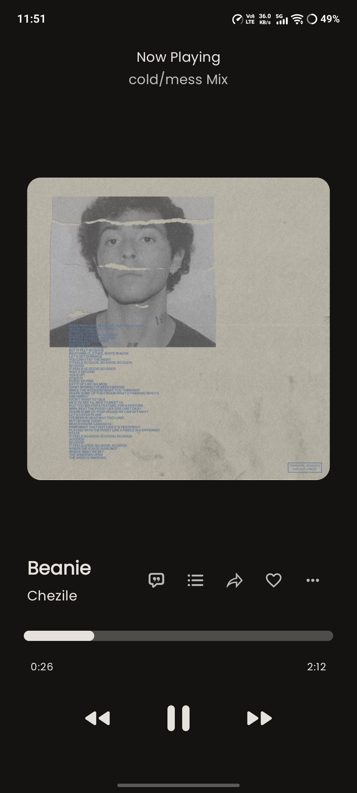
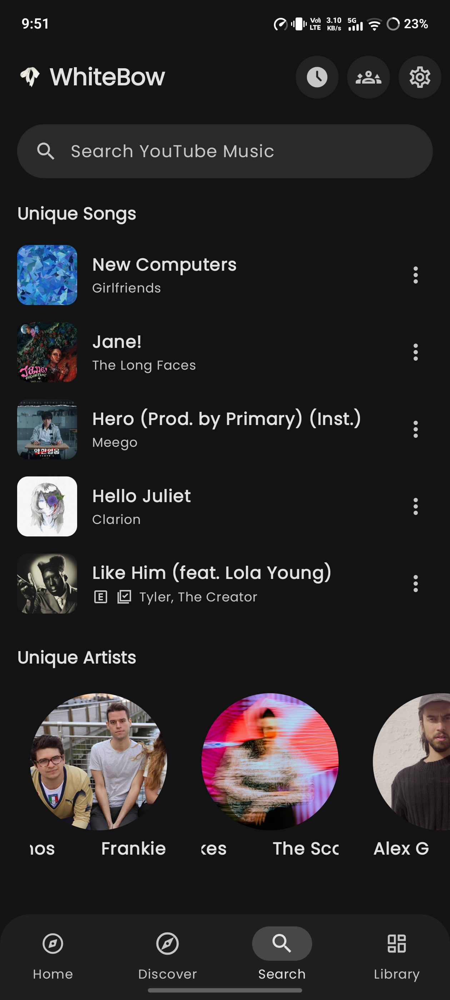
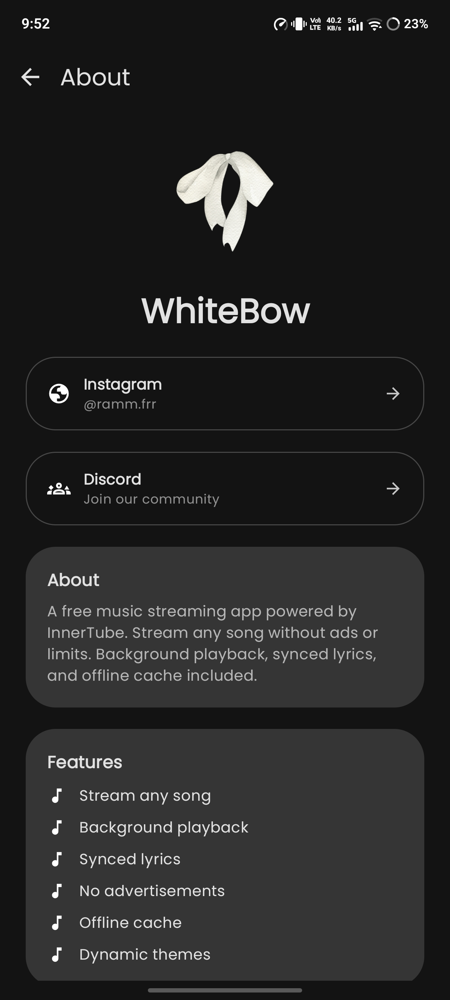
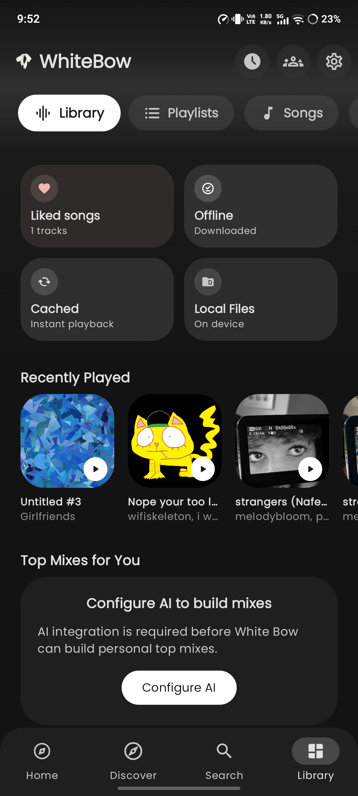

<p align="center">
  
</p>

<h1 align="center">White Bow 🎵</h1>

<p align="center">
  <b>A modern music streaming app with unique discovery features</b>
</p>

<p align="center">
  
  
  
  
  
</p>

---

## 📱 Screenshots

<p align="center">
  
  
  
  
</p>


## ✨ Unique Features

### 🃏 Discover — Tinder-Style Music Discovery
Swipe through songs like never before. Right swipe to like, left to skip. Smart recommendations that never repeat.

- Smooth card swipe animations
- Undo last skip button
- No instrumental/duplicate songs
- Like/Skip/Share in one place

### 🖼️ Song Share Cards
Share what you're listening to with beautiful promo cards — like Spotify but customizable.

- 5 card template styles (Golden, CD Case, Gradient, Neon, Vintage)
- Custom PNG template support — design your own!
- Song art + title + artist auto-filled
- One-tap share to any social app

### 🔄 In-App Auto Updates
Never miss a new version. App checks GitHub releases automatically.

- Silent background download
- "Tap to install" notification
- No Play Store needed

---

## 🎵 Core Features

| Feature | Description |
|---------|-------------|
| 🎧 **Streaming** | Millions of songs via YouTube Music InnerTube API |
| 🎤 **Lyrics** | 11+ providers with synced animations (Apple, Karaoke, Glow) |
| 🎨 **9 Player Designs** | V1-V9 with gradient, blur, glow backgrounds |
| 📻 **Equalizer** | Built-in EQ with bass boost, virtualizer |
| 🌙 **AOD Mode** | Always-on-display player with 18+ artwork shapes |
| 🔊 **Crossfade** | Smooth transitions between songs |
| 📱 **Widgets** | Now Playing, Quick Controls, Listening Stats |
| 🚗 **Android Auto** | Full support |
| 🎵 **Music Recognition** | Shazam-like built-in |
| 👥 **Music Together** | Listen with friends in sync |

---

## 🔗 Integrations

```
┌─────────────────────────────────────────┐
│  Discord Rich Presence    ✅ Supported  │
│  Last.fm Scrobbling       ✅ Supported  │
│  ListenBrainz             ✅ Supported  │
│  Spotify Playlists        ✅ Import     │
│  YouTube Music Sync       ✅ Supported  │
│  AI Lyrics Translation    ✅ Supported  │
└─────────────────────────────────────────┘
```


## 🛠️ Tech Stack

| Layer | Technology |
|-------|-----------|
| UI | Jetpack Compose + Material 3 |
| DI | Hilt (Dagger) |
| Database | Room |
| Audio | Media3 ExoPlayer |
| Network | Ktor + OkHttp |
| Image | Coil 3 |
| Music | InnerTube API + NewPipe Extractor |

---


## 🤝 Contributing

Pull requests welcome! For major changes, open an issue first.

## 📄 License

[GPL-3.0](LICENSE)

---

<p align="center">
  Made with ❤️ by <a href="https://github.com/ramm-fr">ramm-fr</a>
</p>
# White-bow
